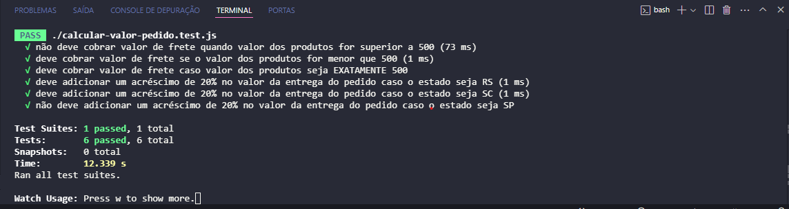

# Calcular Valor de Pedidos com Testes Automatizados (Jest)

Este projeto é meu primeiro repositório com testes automatizados.

## Instalação

Para instalar as dependências do projeto, primeiro, baixe o repositório e navegue até a pasta do projeto. Em seguida, execute o comando abaixo:

```bash
npm install
```

## Observações

Certifique-se de ter o Node.JS e o NPM (node package manager) instalados na sua máquina antes de executar o comando!

## Iniciando os Testes Automatizados

Após baixar todas dependências do projeto, execute o comando abaixo para garantir que os testes rodem automaticamente após qualquer mínima alteração no seu código:

```bash
npm run watch
```

## Contribuição

1) Clone o repositório.
2) Crie uma nova branch para suas mudanças.
3) Envie um Pull Request quando finalizar.

## Notas sobre o .gitignore

Este projeto inclui um arquivo .gitignore com a seguinte configuração:

node_modules/

A pasta node_modules é ignorada porque contém arquivos que são recriados automaticamente ao rodar npm install. O arquivo package-lock.json, no entanto, não é ignorado, pois ele é importante para garantir a consistência nas versões das dependências.

## Print dos 6 testes passando

<div align="center">
    
</div>